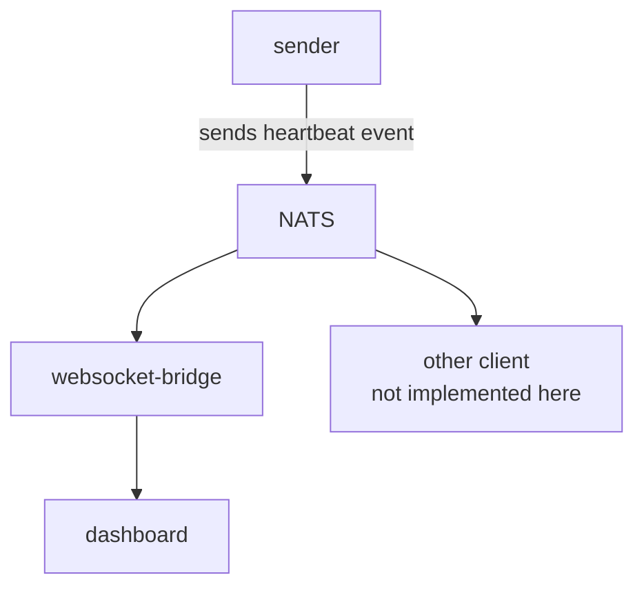

# Events

Perform an action when new data arrives. Some dataset series are being continuously updated. For example a new radar scan is made every 5 minutes or a numerical weather prediction model is scheduled to run every hour. In order to avoid polling of storage and distribution systems, clients subscribe to events that are sent every time change occurs.
These events carry necessary metadata about data resources that have been produced, made available or removed. Among these are a unique ID, relation to existing dataset series and location of the resource in diverse storage and distribution systems.
Events are described using [cloudevents](https://cloudevents.io/) specification.

# Diagram

# Used sources
This prototype is based on examples available in the 1.y.z branch of the cloudevents [sdk-go](https://github.com/cloudevents/sdk-go/tree/release-1.y.z).